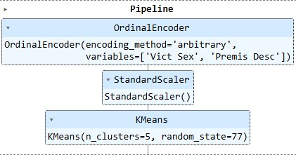

# Crime Damage Prediction and Clustering App
## Overview
This project aims to build a Machine Learning (ML) pipeline for crime damage prediction and clustering. The project involves data analysis, prediction of damage amount (regression), and the grouping of similar criminal incidents using clustering (unsupervised learning).

The app provides actionable insights for decision-making, such as predicting the likely cost of damages and understanding different types of crime patterns through clustering.

This repository includes the code, data, and documentation for the ML pipeline and Streamlit-based web app, with database integrated on Heroku.

See my [Github repository](https://github.com/Cyril-CRGB/PP5_My_project.git)

## Project Features
1. Damage Cost Prediction: Predict the cost of damage a crime victim might endure based on various input features (e.g., crime type, location, and victim information).
2. Clustering: Perform clustering analysis to group crimes into distinct patterns.
3. Feature Engineering and Analysis: Key steps include data preprocessing, feature engineering, and selecting the most relevant features for the models.
4. ML Algorithms: We use Random Forest for regression and KMeans for clustering.
5. Evaluation Metrics: Evaluation using R² score, Mean Absolute Error (MAE), Mean Squared Error (MSE) for regression, and silhouette scores for clustering.

## How to use this repo
### Setup the Environment
1. Clone this [repo](https://github.com/Cyril-CRGB/PP5_My_project.git)

2. Install the required packages: pip install -r requirements.txt

3. Load the data: The project works with the crime dataset, which is uploaded in the data/ folder. It includes crime information such as location, victim details, and types of crimes. You might also want to upload the original dataset, that you will find in 1datacollection.ipynb.

4. Run the Streamlit app with the command "streamlit run app.py"

### Running the ML Pipelines
To run the Machine Learning pipelines:

1. Damage Prediction: Run the regression model by navigating to the "Predictions prod" page in the Streamlit app. The model will predict the amount of damage based on crime information. _(available only in Jupyternotebook 5 and 6, see .ipynb files)_

2. Clustering: Run the clustering algorithm by selecting the "Predictions prod" page. The app will display the clustering results and provide insights into different crime clusters.

## Dataset Content
The dataset used in this project contains detailed records of crimes, including:

| Variable         | Description                          | Data Type   |
|:-----------------|:-------------------------------------|:-----------:|
| `DATE OCC`       | Date of occurrence of the crime      | Date        |
| `Vict Sex`       | Sex of the victim                    | String      |
| `Vict Descent`   | Victim’s descent                     | String      |
| `Premis Desc`    | Description of premises              | String      |
| `Amount`         | Cost estimation of damage            | Float       |
| `Crm Cd`         | Primary code for the crime           | Integer     |
| `Weapon Desc`    | Description of the weapon            | String      |

Note: In the feature engineering step, some categorical features are encoded, and missing values are imputed using various techniques.

## Project Terms & Jargon
* Damage: The estimated monetary cost associated with the crime.
* Clustering: Grouping similar crime incidents based on features like sex/gender and type of crime.
* Regression: Predicting the amount of damage in dollars. _(available in Jupyternotebook 5 and 6)_

## Business Requirements
1. Clustering Analysis:
* Perform clustering to group crime incidents and predict in which group the individual selected belongs, thus determining the probability of becoming the victime of a violent crime.
2. Damage Cost Prediction:
* Predict the likely damage cost a victim would endure using the same clustering model. _(a regression model is only available in Jupyternotebook 5 and 6)_

## Hypothesis and how to validate?
1. Hypothesis: 
- **(a)** We expected that Damage and Amount would be done depending on the identity of the victim.
- **(b)** We expected that Damage and Amount would be correlated to the Weapon Used Cd and Crm Cd (crime committed).
- **(c)** We expected that Damage and Amount would be correlated to Area and Time OCC.
2. Validation: 
- **(a)** ✅ The correlation study support this, we see that Vict Sex, Vict Descent and Vict Age are amongst the top 6 features.
- **(b)** ✅ The correlation study support this, Weapon Used Cd is in both case the best correlated feature.
- **(c)** ❌ The correlation study does not support this. We really expected crime to occurs at night, outside in the weekend and/or in area where a lot of damage could be caused (richer area).

## ML Models
### Damage Prediction (Regression) _(available in Jupyternotebook 5 and 6)_
Model: Random Forest Regressor
Target: Predicting the Amount (damage cost in USD)
Features: All other variables except those deemed unnecessary, like dates and non-influential features.
Evaluation Metrics:
R² Score
Mean Absolute Error (MAE)
Mean Squared Error (MSE)
### Clustering (KMeans)
Model: KMeans Clustering
Number of Clusters: Determined using the Elbow Method and Silhouette Scores.
Features: Key features selected through Principal Component Analysis (PCA).
Evaluation Metrics:
Silhouette Score
Visualization of clusters in relation to key features.

Here is the reduced version, after identifing the PCA (which is then not anymore necessary) and the ideal number of cluster:

### Model Evaluation
#### Regression Model Performance _(available in Jupyternotebook 5 and 6)_
Train Set:
R² Score: 0.998
Mean Absolute Error: 26.97
Root Mean Squared Error: 363.02
Test Set:
R² Score: 0.998
Mean Absolute Error: 31.23
Root Mean Squared Error: 347.05
#### Clustering Performance
Average Silhouette Score: 0.45

## Dashboard Design
* Summary:
Provides an overview of the business requirements, the dataset, and key objectives of the project.
* Data:
What was done with the data, all operations
* Study:
The study about the data that was conducted, allowing me to understand the best way to come to meet the business requirement
* Hypothesis % Validation.
* ML Cluster: 
Displays the clustering results, including the elbow method and silhouette score. Shows visualizations of the cluster distributions.
Provides detailed profiles of each cluster, including the most common features in each group (e.g., type of crime, location).
Display the clustering results for reduced best features. 
* Predictions prod:
Help the client/user draw a subscription profile for risk avers people. 

## Unfixed Bugs
* none that I know of

## Deployment
### Heroku
* The App live link is: [Insurance Prospecter](https://insuranceprospecter-myproject5-87117df1ba0b.herokuapp.com/)
* Set the runtime.txt Python version to a [Heroku-20](https://devcenter.heroku.com/articles/python-support#supported-runtimes) stack currently supported version.
* Be aware of the fact that [Heroku-20] builds will be disabled as per 05/01/2025 (EOL) on Heroku, this could have an impact on this app. 
* The project was deployed to Heroku using the following steps.

1. Log in to Heroku and create an App
2. At the Deploy tab, select GitHub as the deployment method.
3. Select your repository name and click Search. Once it is found, click Connect.
4. Select the branch you want to deploy, then click Deploy Branch.
5. The deployment process should happen smoothly if all deployment files are fully functional. Click now the button Open App on the top of the page to access your App.
6. If the slug size is too large then add large files not required for the app to the .slugignore file. Or delete some dependencies. Or like I did also subscribe to heroku postgresql database services.

## Main Data Analysis and Machine Learning Libraries
* pandas and numpy and scikit-learn

## Credits 
* I used a lot of content from Code Institute 

## Acknowledgements
* The [Churnometer](https://github.com/Code-Institute-Solutions/churnometer.git) application from Code Institute was a great source of inspiration.

## Fixed bug
the original input file was to big >100MB so I add to:
- add the file to .gitignore file
- install and use Git LFS for tracking the file
- deleting the csv file with git filter-branch
- forcing the push to github with the command "git push origin main --force"

Some of the variables in the dataset contained NaN. 
- I had to check and remove those before studying correlations in the Notebook "study".

I dropped a handmade file, and i could not load it in Notebook 2 (2datacleaning), I needed to specifiy delimiter.

In the Notebook 3datastudy i could not use OneHotEncoder (even with drop_last=True) because it made the data overfit.

Deployement issues:
- I deployed two times, and each time the deployment was difficult due to uncompatiblities between librairies/Heroku/Python version.
- I got rid of (uninstall) nvidia-nccl-cu12 2.23.4 package to fix slug size issue with heroku.

I had to install posgresql on my local machine, fixing path settings on my local machine, then connect to CLI of Heroku in order to puhs my csv file.

gazetteanaliticstools:

commande: 

1) pyenv install 3.9.13
2) pip install requests xmltodict psycopg2-binary pandas
2) python3 file_name.py
4) pip install python-dotenv
5) add .env file with DATABASE_URL
6) add .env to .gitignore

7) pip freeze > requirements.txt
8) pip install -r requirements.txt